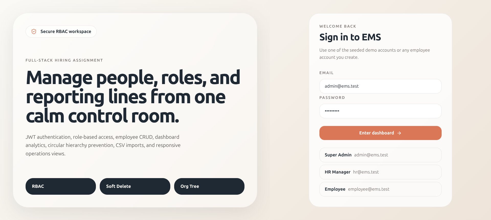
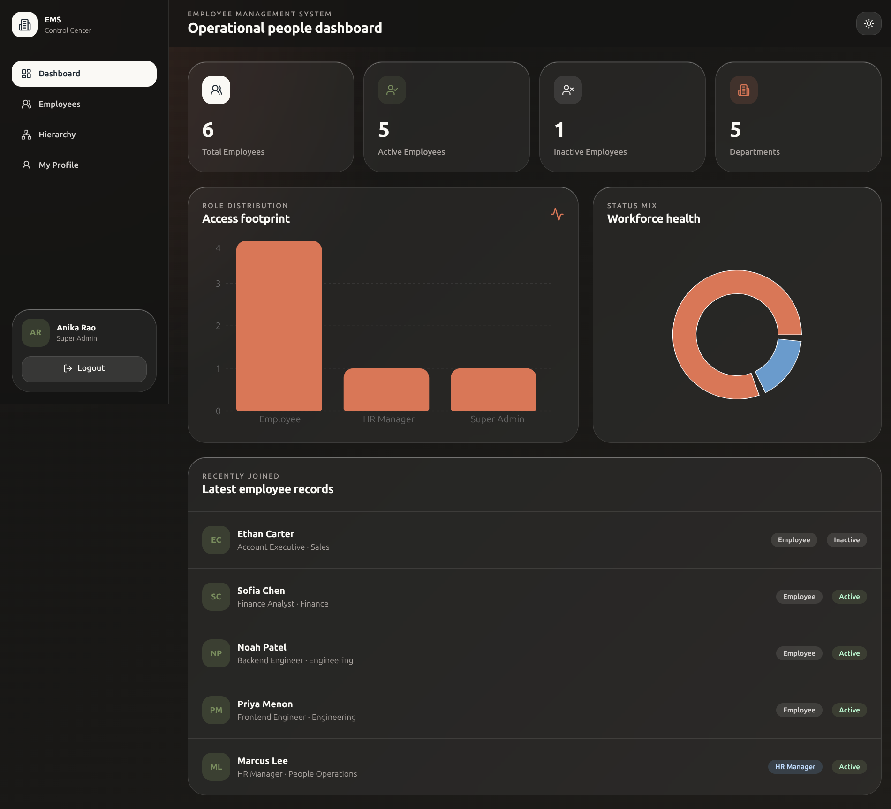
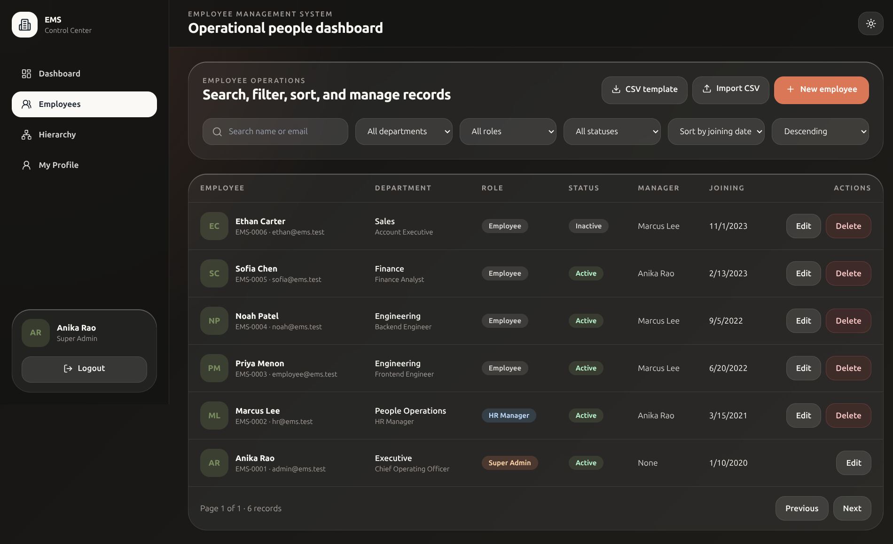
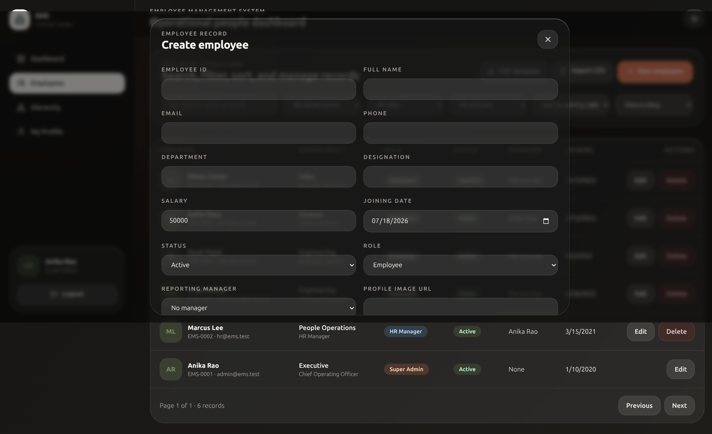
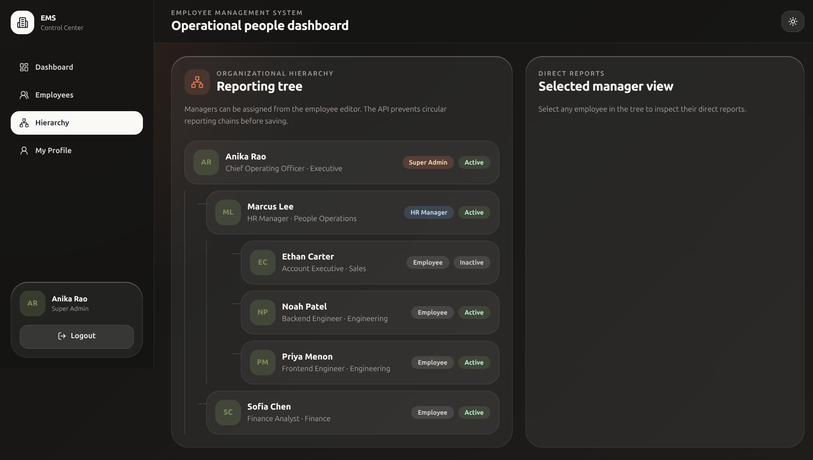

# Employee Management System

A full-stack Employee Management System built for the Full Stack Developer hiring assignment.

Repository: `https://github.com/offlvenkatesh/employee-management-system`

## Tech Stack

- Frontend: React, TypeScript, Vite, Tailwind CSS, React Query, Recharts
- Backend: Node.js, Express, TypeScript, Mongoose
- Database: MongoDB
- Authentication: JWT and bcrypt password hashing
- Deployment: Docker Compose, Vercel-ready frontend/backend configuration

## Features

- Secure login/logout with JWT authentication
- Protected frontend routes and backend middleware
- Role-based access control for Super Admin, HR Manager, and Employee
- Employee CRUD with soft delete
- Employee fields: Employee ID, name, email, phone, department, designation, salary, joining date, status, role, reporting manager, profile image
- Dashboard metrics: total employees, active employees, inactive employees, department count
- Dashboard charts for role distribution and status mix
- Search by name/email
- Filter by department, role, and status
- Sort by joining date or name
- Pagination
- Reporting manager assignment
- Direct reportees endpoint and UI panel
- Organization tree view
- Circular reporting prevention
- Frontend and backend validation
- CSV import for employees
- Dark mode
- Docker support
- Unit test for hierarchy cycle detection

## Demo Accounts

Seed data creates these accounts:

| Role | Email | Password |
| --- | --- | --- |
| Super Admin | `admin@ems.test` | `Admin@123` |
| HR Manager | `hr@ems.test` | `Hr@12345` |
| Employee | `employee@ems.test` | `Employee@123` |

## Quick Start With Docker

```bash
docker compose up --build
```

Then open:

- Frontend: `http://localhost:5173`
- API: `http://localhost:4000`
- Health: `http://localhost:4000/health`

The Docker server starts with `SEED_ON_START=true`, so demo accounts are created automatically.

## How To Run Locally

Backend and frontend are managed as npm workspaces from the project root.

```bash
npm install
docker run --name ems-mongo -p 27017:27017 -d mongo:7
npm run seed
npm run dev
```

Local URLs:

- Frontend: `http://localhost:5173`
- Backend API: `http://localhost:4000`

## Vercel Deployment

The repository includes Vercel configuration for separate frontend and backend projects.

- Frontend project from root directory `client`: uses `client/vercel.json`, serves `dist`, and rewrites SPA routes to `index.html`.
- Backend project from root directory `server`: uses `server/vercel.json` and `server/api/index.ts` for the Express serverless function.

For frontend-only Vercel deployment, select root directory `client`, framework `Vite`, build command `npm run build`, output directory `dist`, and set `VITE_API_URL` to the deployed backend URL.

Required Vercel environment variables for a full live deployment:

| Variable | Value |
| --- | --- |
| `MONGO_URI` | MongoDB Atlas connection string |
| `JWT_SECRET` | Long random production secret |
| `JWT_EXPIRES_IN` | Example: `8h` |
| `CLIENT_ORIGIN` | Your Vercel deployment URL |
| `SEED_ON_START` | `true` for demo accounts, otherwise `false` |

`VITE_API_URL` can be omitted on Vercel because the frontend uses same-origin `/api` calls in production.

Copy env examples if you want to override local defaults.

```bash
cp server/.env.example server/.env
cp client/.env.example client/.env
```

Important: for a working live backend on Vercel, use a hosted MongoDB database such as MongoDB Atlas. `localhost` MongoDB only works on your local machine.

## Verification Commands

```bash
npm run build
npm test
```

## Screenshots

- Login page: `docs/screenshots/login.png`
- Dashboard: `docs/screenshots/dashboard.png`
- Employee list: `docs/screenshots/employees.png`
- Add employee form: `docs/screenshots/add-employee.png`
- Organization hierarchy: `docs/screenshots/organization.png`

### Login Page



### Dashboard



### Employee List



### Add Employee Form



### Organization Hierarchy



## Project Structure

```text
client/
  # Frontend React application
  src/components/       Reusable UI components
  src/pages/            Dashboard, Employees, Organization, Profile, Login
  src/providers/        Auth provider
  src/lib/              API client and token storage
server/
  # Backend Express API
  src/auth/             Login, JWT auth middleware, RBAC helpers
  src/employees/        Employee model, validation, controller, service
  src/organization/     Reporting tree and cycle detection
  src/dashboard/        Dashboard stats
  src/shared/           Error handling, request ID, logging
  src/scripts/          Seed data
docs/API.md             API documentation
```

## API Documentation

Detailed API documentation is available in `docs/API.md`.

Quick endpoint summary:

| Method | Endpoint | Description | Auth |
| --- | --- | --- | --- |
| `POST` | `/api/auth/login` | Login user and return JWT | Public |
| `POST` | `/api/auth/logout` | Logout current user | Protected |
| `GET` | `/api/auth/me` | Get current user profile | Protected |
| `GET` | `/api/dashboard/stats` | Dashboard totals and chart data | Protected |
| `GET` | `/api/employees` | List employees with search/filter/sort/pagination | Protected |
| `POST` | `/api/employees` | Create employee | Super Admin, HR Manager |
| `GET` | `/api/employees/:id` | Get employee details | Protected |
| `PUT` | `/api/employees/:id` | Update employee | Role scoped |
| `DELETE` | `/api/employees/:id` | Soft delete employee | Super Admin |
| `POST` | `/api/employees/import` | Import employees from CSV | Super Admin, HR Manager |
| `GET` | `/api/employees/:id/reportees` | Show direct reports | Protected |
| `PATCH` | `/api/employees/:id/manager` | Assign reporting manager | Super Admin, HR Manager |
| `GET` | `/api/organization/tree` | Show reporting hierarchy tree | Protected |

## RBAC Rules

- Super Admin: full access, can create/edit/delete employees, assign roles, assign managers.
- HR Manager: can create/edit/view employees and import CSV, cannot delete employees or assign Super Admin role.
- Employee: can view and edit only their own limited profile fields: phone and profile image.

## Notes

- Delete is implemented as soft delete by setting `isDeleted=true` and `status=INACTIVE`.
- Logout is stateless for JWT and clears the client token.
- For a production system, replace the demo JWT secret, use HTTPS, and move auth persistence to an httpOnly refresh-token flow.
